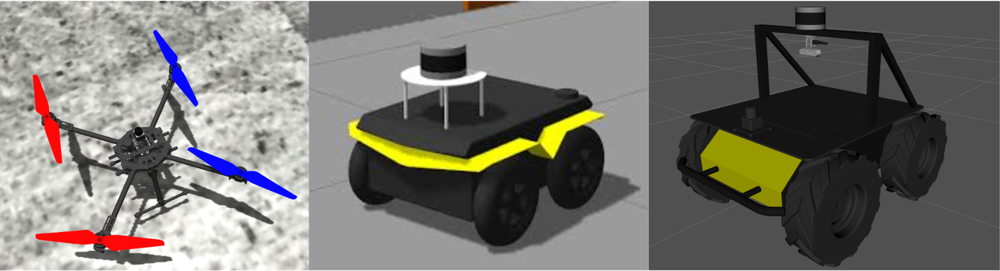
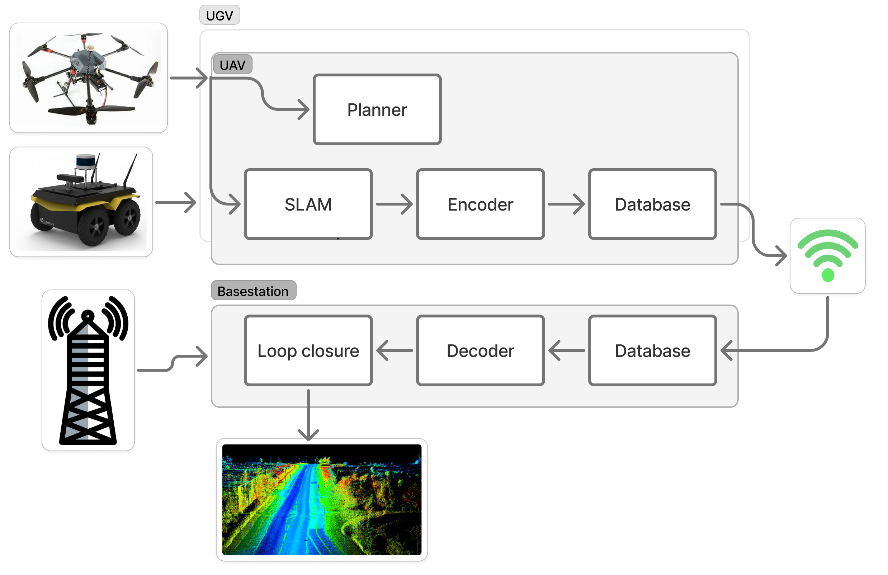
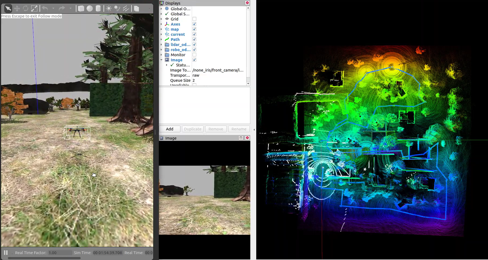
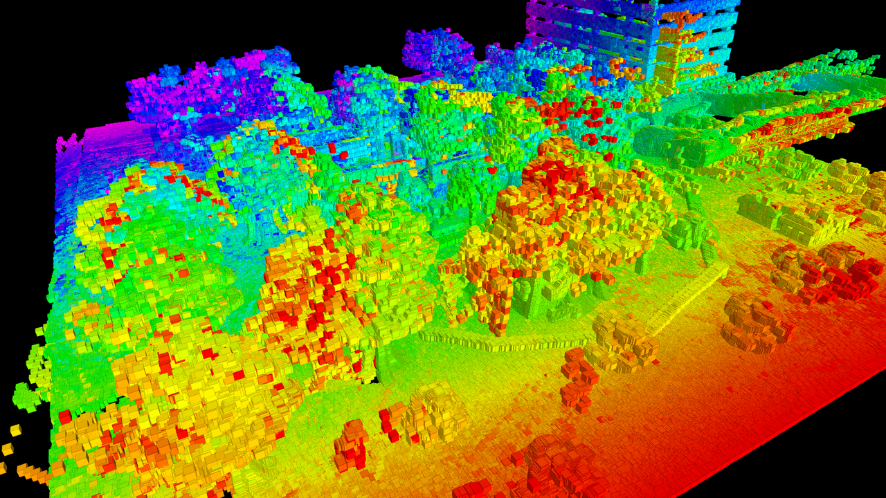

# MRM Multi-Robot System — Runtime Guide

> **Video Demo:** 🎥 [YouTube Playlist — MRM System Demonstrations](https://www.youtube.com/playlist?list=PLER8n99Vgcew)

---

## System Overview

| | |
|:---:|:---:|
|  |  |
| *Tarot UAV, Jackal UGV and Husky operating together in the Gazebo simulation environment* | *System pipeline overview: LiDAR → Super-LIO → VAE → MOCHA → LAMP* |
|  |  |
| *Abandoned mine environment used for multi-robot exploration experiments* | *YOLOv8 object detection on robot camera streams* |

---

## Demo Video

**Husky UGV exploring an abandoned mine environment (50× speed)**

<video src="husky_abandoned_x50.mp4" controls width="100%" style="max-width:800px">
  <a href="husky_abandoned_x50.mp4">Download demo video (husky_abandoned_x50.mp4)</a>
</video>

> 💡 If the video does not play above, [click here to download it](husky_abandoned_x50.mp4)
> or watch the full playlist on [YouTube](https://www.youtube.com/playlist?list=PLER8n99Vgcew).

---

| Repository | Link | Description |
|---|---|---|
| **runs_project** | [IVSR-RaA/runs_project](https://github.com/IVSR-RaA/runs_project) | Main launch scripts for the MRM system, network configuration, and mission files |
| **Super-LIO** | [IVSR-RaA/Super-LIO](https://github.com/IVSR-RaA/Super-LIO) | LiDAR-Inertial Odometry (SLAM front-end) for the UAV, Jackal, and Husky |
| **super_lio_lamp_adapter** | [IVSR-RaA/super_lio_lamp_adapter](https://github.com/IVSR-RaA/super_lio_lamp_adapter) | Adapter bridging Super-LIO output to LAMP and the VAE keyframe pipeline |
| **pcl-vae** | [IVSR-RaA/pcl-vae](https://github.com/IVSR-RaA/pcl-vae) | Variational Autoencoder for point cloud compression before MOCHA transmission |
| **mocha_tplink** | [IVSR-RaA/mocha_tplink](https://github.com/IVSR-RaA/mocha_tplink) | Multi-robot Communication Hub — synchronizes VAE keyframes across robots via ZeroMQ |
| **mrm_run_launch** | [IVSR-RaA/mrm_run_launch](https://github.com/IVSR-RaA/mrm_run_launch) | ROS launch files for the full MRM stack (UAV, UGV, Husky, base station) |
| **cmu-planner** | [IVSR-RaA/cmu-planner](https://github.com/IVSR-RaA/cmu-planner) | CMU local planner and waypoint follower for Jackal/Husky ground navigation |
| **emb** | [IVSR-RaA/emb](https://github.com/IVSR-RaA/emb) | PX4 geometric controller, sequence controller, and EGO-Planner for the UAV |
| **multirobot_yolo** | [IVSR-RaA/multirobot_yolo](https://github.com/IVSR-RaA/multirobot_yolo) | YOLOv8 object detection integrated across all robots in the system |

---

## Runtime Guide

`run/run_mrm.sh` starts the runtime tmux session for simulation, MOCHA, VAE,
Super-LIO, LAMP, the optional ground planners, and the UAV sequence controller.
It does not automatically start RViz, rqt tools, tcpdump, or other inspection
tools. Use the debug commands in this file from separate terminals when needed.

## Contents

- [Quick Start](#quick-start)
- [Runtime Modes](#runtime-modes)
- [Runtime Option Reference](#runtime-option-reference)
- [Robot Selection and Two-Robot Runs](#robot-selection-and-two-robot-runs)
- [Late Robot Join and MOCHA Synchronization](#late-robot-join-and-mocha-synchronization)
- [Optional RGB Cameras](#optional-rgb-cameras)
- [Optional YOLOv8 Detection](#optional-yolov8-detection)
- [Benchmarking](#benchmarking)
- [Network Defaults](#network-defaults)
- [Single-Laptop Virtual IP Setup](#single-laptop-virtual-ip-setup)
- [Distributed Laptop Setup](#distributed-laptop-setup)
- [Four-Laptop Centralized Setup](#four-laptop-centralized-setup)
- [Centralized Multi-Hop MOCHA](#centralized-multi-hop-mocha)
- [Final Map Topics](#final-map-topics)
- [RViz and Debug Tools](#rviz-and-debug-tools)
- [Runtime Tuning](#runtime-tuning)
- [Ground LiDAR and Super-LIO Extrinsics](#ground-lidar-and-super-lio-extrinsics)
- [GNN Loop-Closure Batcher](#gnn-loop-closure-batcher)
- [SOLiD Loop Condition](#solid-loop-condition)
- [Mission Files](#mission-files)
- [CMU Planners](#cmu-planners)
- [UAV PX4 Sequence Controller](#uav-px4-sequence-controller)
- [UAV EGO-Planner Obstacle Avoidance](#uav-ego-planner-obstacle-avoidance)
- [VAE Model Selection](#vae-model-selection)
- [WiFi Payload Measurement](#wifi-payload-measurement)
- [Range Image Debug](#range-image-debug)
- [Docker Image Storage On Another Disk](#docker-image-storage-on-another-disk)
- [Troubleshooting Notes](#troubleshooting-notes)

## Quick Start

Centralized/base-station mode:

```bash
cd /home/nlg/all_ws
sudo -v
./run/run_mrm.sh --no-attach
```

Distributed mode:

```bash
cd /home/nlg/all_ws
sudo -v
./run/run_mrm.sh --distributed --no-attach
```

Start only one runtime group:

```bash
cd /home/nlg/all_ws
./run/run_mrm.sh --only ugv --no-attach
./run/run_mrm.sh --only uav --no-attach
./run/run_mrm.sh --only husky --no-attach
./run/run_mrm.sh --only base --no-attach
```

Attach or stop the runtime session:

```bash
tmux attach -t mrm-debug
```

```bash
cd /home/nlg/all_ws
./run/run_mrm.sh --kill
```

## Runtime Modes

| Command | Runtime groups | LAMP topology | Main map to inspect |
| --- | --- | --- | --- |
| `./run/run_mrm.sh --no-attach` | UAV, UGV, Husky, base | Centralized base aggregator | Base master `/base1/lamp/octree_map` |
| `./run/run_mrm.sh --distributed --no-attach` | UAV, UGV, Husky | One LAMP fusion process on each robot | UAV, UGV, and Husky robot masters |
| `./run/run_mrm.sh --only ugv --no-attach` | UGV only | Centralized-compatible local runtime | UGV local topics |
| `./run/run_mrm.sh --only uav --no-attach` | UAV only | Centralized-compatible local runtime | UAV local topics |
| `./run/run_mrm.sh --only husky --no-attach` | Husky only | Centralized-compatible local runtime | Husky local topics |
| `./run/run_mrm.sh --only base --no-attach` | Base only | Centralized base aggregator | Base master topics |

`--only base` is not valid with `--distributed`. Distributed mode has no base
runtime; each robot runs its own local fusion LAMP.

## Runtime Option Reference

Command-line options:

| Option | Meaning |
| --- | --- |
| `--only all` | Run UAV, Jackal, Husky, and the base in centralized mode; run all three robots in distributed mode. This is the default. |
| `--only uav` | Run only the `none_iris` UAV group. |
| `--only ugv` | Run only the `jackal` UGV group. |
| `--only husky` | Run only the Husky group. |
| `--only base` | Run only the centralized base group. Invalid in distributed mode. |
| `--lamp-mode base` | Use centralized LAMP at the base station. This is the default. |
| `--lamp-mode distributed` | Run one fusion LAMP process on each selected robot master. |
| `--distributed` | Shortcut for `--lamp-mode distributed`. |
| `--mission FILE` | Import Jackal, Husky, and/or UAV waypoints from one YAML mission file. It automatically enables the selected robot's planner/controller. |
| `--no-attach` | Start the tmux session without attaching to it. |
| `--attach` | Attach to the existing `mrm-debug` tmux session. |
| `--kill` | Stop the runtime session and its managed MOCHA/Gazebo listeners. |
| `--help` | Print the script usage. |

Runtime-group start delays:

| Variable | Default | Effect |
| --- | --- | --- |
| `UAV_START_DELAY` | `0` | Delay the complete UAV group by this many seconds. |
| `UGV_START_DELAY` | `0` | Delay the complete Jackal group by this many seconds. |
| `HUSKY_START_DELAY` | `0` | Delay the complete Husky group by this many seconds. |
| `BASE_START_DELAY` | `0` | Delay the complete base group by this many seconds. |

The delay is applied to the group's ROS master. All other panes wait for that
master and start together after the delay.

Major optional components:

| Component | Default | Global or robot-specific override |
| --- | --- | --- |
| RGB cameras | Off | `ENABLE_RGB_CAMERAS`, `UAV_ENABLE_CAMERA`, `UGV_ENABLE_CAMERA`, `HUSKY_ENABLE_CAMERA` |
| YOLOv8 | Off | `ENABLE_YOLO`, `UAV_ENABLE_YOLO`, `UGV_ENABLE_YOLO`, `HUSKY_ENABLE_YOLO` |
| Jackal CMU planner | On | `UGV_ENABLE_CMU_PLANNER` |
| Husky CMU planner | Off | `HUSKY_ENABLE_CMU_PLANNER` |
| UAV sequence controller | On | `UAV_ENABLE_SEQUENCE_CONTROLLER` |
| UAV EGO-Planner | Off | `UAV_ENABLE_EGO_PLANNER` |
| GNN loop-closure batcher | Off | `RUN_GNN_BATCHER` |
| SOLiD loop condition | Off | `USE_SOLID_LOOP_CONDITION` |

Boolean environment variables use the literal values `true` and `false`.
Environment overrides apply only to the command on which they are supplied.

Common single-robot planner/controller combinations:

| Goal | Command |
| --- | --- |
| Jackal with planner | `UGV_ENABLE_CMU_PLANNER=true ./run/run_mrm.sh --only ugv --no-attach` |
| Jackal mapping only | `UGV_ENABLE_CMU_PLANNER=false ./run/run_mrm.sh --only ugv --no-attach` |
| Husky with planner | `HUSKY_ENABLE_CMU_PLANNER=true ./run/run_mrm.sh --only husky --no-attach` |
| Husky mapping only | `HUSKY_ENABLE_CMU_PLANNER=false ./run/run_mrm.sh --only husky --no-attach` |
| UAV with sequence controller | `UAV_ENABLE_SEQUENCE_CONTROLLER=true ./run/run_mrm.sh --only uav --no-attach` |
| UAV mapping only | `UAV_ENABLE_SEQUENCE_CONTROLLER=false ./run/run_mrm.sh --only uav --no-attach` |

Run all robots with mapping components only:

```bash
cd /home/nlg/all_ws
UGV_ENABLE_CMU_PLANNER=false \
HUSKY_ENABLE_CMU_PLANNER=false \
UAV_ENABLE_SEQUENCE_CONTROLLER=false \
ENABLE_RGB_CAMERAS=false \
ENABLE_YOLO=false \
RUN_GNN_BATCHER=false \
USE_SOLID_LOOP_CONDITION=false \
./run/run_mrm.sh --no-attach
```

Run all robots with the optional processing components enabled:

```bash
cd /home/nlg/all_ws
UGV_ENABLE_CMU_PLANNER=true \
HUSKY_ENABLE_CMU_PLANNER=true \
UAV_ENABLE_SEQUENCE_CONTROLLER=true \
ENABLE_YOLO=true \
YOLO_PUBLISH_ANNOTATED=true \
RUN_GNN_BATCHER=true \
USE_SOLID_LOOP_CONDITION=true \
./run/run_mrm.sh --no-attach
```

The second command is resource-heavy: it starts three VAE pipelines, three
detectors and cameras, two ground planners, the UAV controller, SOLiD, and the
GNN batcher. Reduce `YOLO_MAX_RATE` or use `YOLO_DEVICE=cpu` when GPU memory is
limited.

`RUN_GNN_BATCHER` and `USE_SOLID_LOOP_CONDITION` configure a LAMP process. In
centralized mode they take effect on the base group. A centralized
`--only ugv`, `--only uav`, or `--only husky` run does not launch a local fusion
LAMP, so these two flags have no local process to configure. They take effect
on robot masters in distributed mode.

## Robot Selection and Two-Robot Runs

One `run_mrm.sh` invocation accepts exactly one value after `--only`:
`uav`, `ugv`, `husky`, `base`, or `all`. A comma-separated selector such as
`--only uav,ugv` is not supported.

Single-robot examples:

```bash
./run/run_mrm.sh --only ugv --no-attach
./run/run_mrm.sh --only uav --distributed --no-attach
./run/run_mrm.sh --only husky --distributed --no-attach
```

For two physical robot laptops, run one selected robot on each laptop. Example
for distributed Jackal plus UAV:

```bash
# Jackal laptop
MANAGE_LOOPBACK_ALIASES=false \
./run/run_mrm.sh --only ugv --distributed --no-attach
```

```bash
# UAV laptop
MANAGE_LOOPBACK_ALIASES=false \
./run/run_mrm.sh --only uav --distributed --no-attach
```

The available physical two-robot pair layouts are:

| Pair | First laptop | Second laptop |
| --- | --- | --- |
| Jackal + UAV | `--only ugv` | `--only uav` |
| Jackal + Husky | `--only ugv` | `--only husky` |
| UAV + Husky | `--only uav` | `--only husky` |

Append `--distributed` to both robot commands for distributed fusion. Leave it
off for centralized mode and start the base group on a separate base laptop.

For centralized Jackal plus UAV, also run the base group on the base laptop:

```bash
# Base laptop
MANAGE_LOOPBACK_ALIASES=false \
RSSI_ROBOTS="jackal none_iris basestation" \
./run/run_mrm.sh --only base --no-attach
```

```bash
# Jackal laptop
MANAGE_LOOPBACK_ALIASES=false ./run/run_mrm.sh --only ugv --no-attach
```

```bash
# UAV laptop
MANAGE_LOOPBACK_ALIASES=false ./run/run_mrm.sh --only uav --no-attach
```

Use the same `UAV_IP`, `UGV_IP`, `HUSKY_IP`, and `BASE_IP` values on every
participating laptop. The generated default MOCHA and LAMP configuration may
still contain the absent third robot; its connection and decoder remain idle.
For a strict two-robot experiment, provide matching custom files through
`MOCHA_ROBOT_CONFIG`, `BASE_LAMP_ROBOT_NAMES_CONFIG`, and
`BASE_RSSI_PARAMETERS_CONFIG`.

On one laptop, use `--only all` for the supported combined simulation. Starting
multiple independent `run_mrm.sh` sessions on one host requires separate
session names, state directories, ROS masters, Gazebo masters, and transport
ports, and is not currently a supported shortcut for arbitrary robot pairs.

## Late Robot Join and MOCHA Synchronization

MOCHA supports a robot joining after the other robots have started, provided
every participant loaded a robot configuration that already contains the late
robot. Communication channels are created when `integrate_database` starts;
adding a robot only to the YAML after startup does not create new channels.

The topic history policies are:

| MOCHA topic | History policy | Late-join result |
| --- | --- | --- |
| `/keyframe_vae` | `WHOLE_HISTORY` | All missing keyframes are transferred and republished oldest-to-newest. |
| `/yolo/detections` | `LAST_MESSAGE` | Only the latest detection array is transferred, followed by future updates. |
| `/yolo/objects` | `LAST_MESSAGE` | Only the latest JSON object state is transferred, followed by future updates. |

Camera images, YOLO annotated images, and visualization markers are not stored
in the MOCHA database.

### One Laptop

Start Jackal and UAV immediately, then start Husky after five minutes:

```bash
cd /home/nlg/all_ws
sudo -v
HUSKY_START_DELAY=300 \
./run/run_mrm.sh --distributed --no-attach
```

Use the same delay in centralized mode:

```bash
cd /home/nlg/all_ws
sudo -v
HUSKY_START_DELAY=300 \
./run/run_mrm.sh --no-attach
```

The command creates the Husky tmux window immediately, but its panes wait until
the delayed Husky ROS master starts. The default generated MOCHA configuration
already contains Jackal, UAV, Husky, and, in centralized mode, the base.

The same pattern works for another delayed group:

```bash
UAV_START_DELAY=120 ./run/run_mrm.sh --distributed --no-attach
UGV_START_DELAY=120 ./run/run_mrm.sh --distributed --no-attach
BASE_START_DELAY=60 ./run/run_mrm.sh --no-attach
```

### Multiple Laptops

Start each robot with the same topology and the same robot IP configuration.
For distributed mode, every laptop's effective configuration must contain:

```text
jackal clients: none_iris, husky
none_iris clients: jackal, husky
husky clients: jackal, none_iris
```

Start Jackal and UAV normally. Five minutes later, run the normal Husky
command on its laptop:

```bash
MANAGE_LOOPBACK_ALIASES=false \
UGV_IP=192.168.0.199 \
UAV_IP=192.168.0.161 \
HUSKY_IP=192.168.0.170 \
./run/run_mrm.sh --only husky --distributed --no-attach
```

Do not use a strict two-robot `MOCHA_ROBOT_CONFIG` for the initial robots if
Husky will join later. Use the generated all-robot configuration, or prepare
one shared configuration containing all three robots and pass its path on
every laptop:

```bash
MOCHA_ROBOT_CONFIG=/absolute/path/to/robot_configs_distributed.yaml \
./run/run_mrm.sh --only ugv --distributed --no-attach
```

For centralized mode, use a configuration that also contains `basestation`
and lists it in every robot's `clients` array.

### Check Synchronization

On robot A, replace `<peer>` with the other MOCHA robot name: `jackal`,
`none_iris`, `husky`, or `basestation`.

```bash
rostopic echo /ddb/client_sync_complete/<peer>
rostopic echo /ddb/server_sync_complete/<peer>
rostopic echo /ddb/client_sm_state/<peer>
rostopic echo /ddb/client_stats/<peer>
```

Synchronization starts only when robot A receives
`/ddb/tplink/rssi/<peer>` above the configured `rssi_threshold`. Check the
trigger first:

```bash
rostopic echo -n1 /ddb/tplink/rssi/<peer>
rosparam get /integrate_database/rssi_threshold
```

Interpretation:

| Topic on robot A | Meaning |
| --- | --- |
| `/ddb/client_sync_complete/<peer>` | A completed one pull cycle from the peer. At that timestamp, A had requested all missing headers advertised by the peer. |
| `/ddb/server_sync_complete/<peer>` | The peer completed one pull cycle from A. |
| `/ddb/client_sm_state/<peer>` | Current synchronization state-machine transitions. A completed cycle ends with `TransmissionEnd to Idle`. |
| `/ddb/client_stats/<peer>` | Successful ZeroMQ request/reply statistics. `msg: DENDT` confirms the end handshake occurred. |
| `/ddb/topic_publisher/headers` | A database record was republished onto the receiving ROS master. |

These event topics are not latched. `rostopic echo -n1` waits for the next
event; it does not report a permanent boolean state. Use a timeout when
checking an active system:

```bash
timeout 20s rostopic echo -n1 /ddb/client_sync_complete/<peer>
echo "exit=$?"
```

Exit code `0` means a completion event arrived. Exit code `124` means no
completion event arrived within 20 seconds; check RSSI, IP reachability, ports,
and the client lists in the robot configuration.

Example: verify on Jackal that synchronization with late-joining Husky works in
both directions:

```bash
source /home/nlg/all_ws/devel/setup.bash
export ROS_MASTER_URI=http://10.229.222.1:11312
export ROS_IP=10.229.222.1

rostopic echo -n1 /ddb/client_sync_complete/husky
rostopic echo -n1 /ddb/server_sync_complete/husky
rostopic echo /ddb/client_stats/husky
```

Use two stages to verify actual data movement:

1. `/ddb/client_sync_complete/husky` confirms the Jackal MOCHA database caught
   up with the headers advertised by Husky.
2. `/husky/keyframe_vae` and `/ddb/topic_publisher/headers` confirm those
   database records were republished onto the Jackal ROS master.

During historical keyframe replay:

```bash
rostopic hz /husky/keyframe_vae
timeout 10s rostopic echo -n1 /husky/keyframe_vae/keyframe_id
timeout 10s rostopic echo -n1 /ddb/topic_publisher/headers
```

After the backlog is consumed, `/husky/keyframe_vae` returns to the live Husky
keyframe rate. Because mapping data continues changing, synchronization is not
a permanent state. A fresh `client_sync_complete` event means robot A caught up
with what the peer advertised during that synchronization cycle.

## Optional RGB Cameras

RGB cameras are off by default. Enable all simulated robot cameras:

```bash
cd /home/nlg/all_ws
ENABLE_RGB_CAMERAS=true ./run/run_mrm.sh --no-attach
```

Enable only one robot camera:

```bash
UGV_ENABLE_CAMERA=true ./run/run_mrm.sh --only ugv --no-attach
UAV_ENABLE_CAMERA=true ./run/run_mrm.sh --only uav --no-attach
HUSKY_ENABLE_CAMERA=true ./run/run_mrm.sh --only husky --no-attach
```

Camera topics:

```text
/jackal/front_camera/image_raw
/jackal/front_camera/camera_info
/none_iris/front_camera/image_raw
/none_iris/front_camera/camera_info
/husky/front_camera/image_raw
/husky/front_camera/camera_info
```

Quick checks from the matching robot master:

```bash
rostopic hz /jackal/front_camera/image_raw
rostopic hz /none_iris/front_camera/image_raw
rostopic hz /husky/front_camera/image_raw
rqt_image_view /jackal/front_camera/image_raw
```

The cameras are for video/debug/benchmark recording. They do not feed Super-LIO,
VAE, MOCHA, or LAMP unless a separate vision pipeline subscribes to them.

## Optional YOLOv8 Detection

YOLO is disabled by default. Enabling it also enables the RGB camera on each
selected robot:

```bash
cd /home/nlg/all_ws
ENABLE_YOLO=true \
YOLO_MODEL=/home/nlg/all_ws/yolov8n.pt \
YOLO_DEVICE=cpu \
YOLO_MAX_RATE=0.5 \
./run/run_mrm.sh --no-attach
```

Enable one detector for an individual robot:

```bash
UGV_ENABLE_YOLO=true ./run/run_mrm.sh --only ugv --no-attach
UAV_ENABLE_YOLO=true ./run/run_mrm.sh --only uav --no-attach
HUSKY_ENABLE_YOLO=true ./run/run_mrm.sh --only husky --no-attach
```

Each robot publishes these local topics:

```text
/yolo/detections       vision_msgs/Detection2DArray
/yolo/objects          std_msgs/String containing JSON metadata
/yolo/markers          visualization_msgs/MarkerArray
/yolo/annotated_image  sensor_msgs/Image, only when enabled and subscribed
```

The JSON payload contains the robot name, image timestamp and frame, current
Super-LIO robot pose, bounding boxes, class names, confidence, bearings, track
IDs, and image-space track history. MOCHA forwards the compact detection
metadata to the other masters. In centralized mode, inspect all three streams
on the base master:

```bash
source /home/nlg/all_ws/devel/setup.bash
export ROS_MASTER_URI=http://10.229.221.1:11311
export ROS_IP=10.229.221.1

rostopic echo /jackal/yolo/objects
rostopic echo /none_iris/yolo/objects
rostopic echo /husky/yolo/objects
```

Local detector checks:

```bash
rostopic hz /jackal/front_camera/image_raw
rosnode ping /yolo/detector
rostopic echo -n1 /yolo/objects
```

`YOLO_FIXED_DEPTH_M=0.0` is the default. In this mode, detections contain image
location and angular bearing, not a measured 3D object position.
`YOLO_FIXED_DEPTH_M=<meters>` adds an approximate fixed-depth position and is
only suitable for visualization. Use a depth sensor or LiDAR-camera association
for metric object locations.

Three CPU detectors can briefly consume several CPU cores each during startup.
For a full single-laptop simulation, begin with `YOLO_MAX_RATE=0.5`; increase it
after the simulators and mapping pipelines are stable.

## Benchmarking

Benchmark files live in [benchmark/README.md](/home/nlg/all_ws/benchmark/README.md).
That folder contains the experiment matrix, RViz presets, rosbag/topic-stat
recorders, video/image capture helpers, and result templates for the paper
story:

```text
MOCHA compressed VAE keyframes -> reconstructed LAMP inputs -> centralized or distributed map fusion
```

Start with:

```bash
cd /home/nlg/all_ws
./run/run_mrm.sh --only husky --no-attach

# In another terminal, record action, metrics, video, and Gazebo replay data.
DISPLAY=:1 \
benchmark/scripts/record_experiment.sh \
  husky_avoidance_001 husky 120 \
  --video --screenshots --gazebo-log --planner-clouds
```

Replace `husky` with `ugv`, `uav`, or `base` as appropriate. Open and maximize
Gazebo or RViz before using `--video`. Results are written under
`benchmark/results/<experiment_id>/`. See the benchmark README for artifact
definitions, camera recording, replay commands, and fair-comparison rules.

## Network Defaults

These defaults live in `run/lib/config.sh`.

| Role | Default IP | ROS master | Gazebo master | Mocha namespace | LAMP namespace | LAMP fusion namespace |
| --- | --- | --- | --- | --- | --- | --- |
| UAV | `10.249.171.1` | `http://10.249.171.1:11313` | `http://127.0.0.1:11345` | `none_iris` | `none_iris2` | `none_iris2_fusion_base` |
| UGV | `10.229.222.1` | `http://10.229.222.1:11312` | `http://127.0.0.1:11346` | `jackal` | `jackal1` | `jackal1_fusion_base` |
| Husky | `10.229.223.1` | `http://10.229.223.1:11314` | `http://127.0.0.1:11347` | `husky` | `husky3` | `husky3_fusion_base` |
| Base | `10.229.221.1` | `http://10.229.221.1:11311` | none | `basestation` | `base1` | `base1` |

Keep UAV, UGV, and Husky on different Gazebo masters. Sharing one Gazebo master
while using different ROS masters can mix `/gazebo` services and topic names.

Mocha and VAE keyframe transport use simulator/model names: `jackal`,
`none_iris`, and `husky`. LAMP map namespaces use numbered names:
`jackal1`, `none_iris2`, and `husky3`. LAMP prefixes map those namespaces to
`a`, `b`, and `c`.

Use ROS-safe names for robot topics. For example use `gazebo_tarot`, not
`gazebo-tarot`, for `UAV_MOCHA_ROBOT`. PX4/Gazebo model filenames can still
contain `-`; ROS graph names should not.

## Single-Laptop Virtual IP Setup

For single-laptop simulation, the default runtime uses loopback aliases so UAV,
UGV, and base look like separate machines:

```bash
sudo ip addr add 10.249.171.1/24 dev lo
sudo ip addr add 10.229.222.1/24 dev lo
sudo ip addr add 10.229.223.1/24 dev lo
sudo ip addr add 10.229.221.1/24 dev lo
```

`run_mrm.sh` can create missing aliases automatically when
`MANAGE_LOOPBACK_ALIASES=true`, which is the default. Run `sudo -v` first if you
want the script to start without a sudo prompt.

## Distributed Laptop Setup

For a real distributed run, do not use loopback aliases. Each robot laptop must
use its real WiFi/Ethernet IP, and every laptop must agree on `UAV_IP`,
`UGV_IP`, `HUSKY_IP`, and the three robot master URIs.

Example network:

```text
UGV laptop IP:   192.168.0.199
UAV laptop IP:   192.168.0.161
Husky laptop IP: 192.168.0.170
```

Find each laptop IP:

```bash
ip -brief addr
ip route get 8.8.8.8
```

Run on the UGV laptop:

```bash
cd /home/nlg/all_ws
./run/run_mrm.sh --kill

MANAGE_LOOPBACK_ALIASES=false \
UGV_IP=192.168.0.199 \
UAV_IP=192.168.0.161 \
HUSKY_IP=192.168.0.170 \
UGV_MASTER_URI=http://192.168.0.199:11312 \
UAV_MASTER_URI=http://192.168.0.161:11313 \
HUSKY_MASTER_URI=http://192.168.0.170:11314 \
./run/run_mrm.sh --only ugv --distributed --no-attach
```

Run on the UAV laptop:

```bash
cd /home/nlg/all_ws
./run/run_mrm.sh --kill

MANAGE_LOOPBACK_ALIASES=false \
UGV_IP=192.168.0.199 \
UAV_IP=192.168.0.161 \
HUSKY_IP=192.168.0.170 \
UGV_MASTER_URI=http://192.168.0.199:11312 \
UAV_MASTER_URI=http://192.168.0.161:11313 \
HUSKY_MASTER_URI=http://192.168.0.170:11314 \
./run/run_mrm.sh --only uav --distributed --no-attach
```

Run on the Husky laptop:

```bash
cd /home/nlg/all_ws
./run/run_mrm.sh --kill

MANAGE_LOOPBACK_ALIASES=false \
UGV_IP=192.168.0.199 \
UAV_IP=192.168.0.161 \
HUSKY_IP=192.168.0.170 \
UGV_MASTER_URI=http://192.168.0.199:11312 \
UAV_MASTER_URI=http://192.168.0.161:11313 \
HUSKY_MASTER_URI=http://192.168.0.170:11314 \
./run/run_mrm.sh --only husky --distributed --no-attach
```

Do not run `--only all` on every laptop. Each laptop owns one robot runtime.

Allow MOCHA/ZeroMQ ports through the firewall:

| Role | Main port |
| --- | --- |
| Base | `1234` |
| UGV | `2234` |
| UAV | `6234` |
| Husky | `7234` |

If using the older base-station topology too, also allow `1235`, `2235`,
`6235`, and `7235`.

Verify the UGV laptop:

```bash
source /home/nlg/all_ws/devel/setup.bash
export ROS_MASTER_URI=http://192.168.0.199:11312
export ROS_IP=192.168.0.199
rostopic hz /jackal/keyframe_vae /none_iris/keyframe_vae /husky/keyframe_vae
rostopic hz /jackal1/lamp/keyed_scans /none_iris2/lamp/keyed_scans /husky3/lamp/keyed_scans
rostopic echo -n1 /jackal1_fusion_base/lamp/octree_map/header
```

Verify the UAV laptop:

```bash
source /home/nlg/all_ws/devel/setup.bash
export ROS_MASTER_URI=http://192.168.0.161:11313
export ROS_IP=192.168.0.161
rostopic hz /none_iris/keyframe_vae /jackal/keyframe_vae /husky/keyframe_vae
rostopic hz /none_iris2/lamp/keyed_scans /jackal1/lamp/keyed_scans /husky3/lamp/keyed_scans
rostopic echo -n1 /none_iris2_fusion_base/lamp/octree_map/header
```

Verify the Husky laptop:

```bash
source /home/nlg/all_ws/devel/setup.bash
export ROS_MASTER_URI=http://192.168.0.170:11314
export ROS_IP=192.168.0.170
rostopic hz /husky/keyframe_vae /jackal/keyframe_vae /none_iris/keyframe_vae
rostopic hz /husky3/lamp/keyed_scans /jackal1/lamp/keyed_scans /none_iris2/lamp/keyed_scans
rostopic echo -n1 /husky3_fusion_base/lamp/octree_map/header
```

## Four-Laptop Centralized Setup

For a real centralized run with three robots, keep the same robot IPs as the
distributed example and add one base-station laptop. Do not use loopback
aliases.

Example network:

```text
Base laptop IP: 192.168.0.150
UGV laptop IP:  192.168.0.199
UAV laptop IP:  192.168.0.161
Husky laptop IP: 192.168.0.170
```

All four laptops must use the same values for `BASE_IP`, `UGV_IP`, `UAV_IP`,
`HUSKY_IP`, `BASE_MASTER_URI`, `UGV_MASTER_URI`, `UAV_MASTER_URI`, and
`HUSKY_MASTER_URI`.

Run on the base laptop:

```bash
cd /home/nlg/all_ws
./run/run_mrm.sh --kill

MANAGE_LOOPBACK_ALIASES=false \
BASE_IP=192.168.0.150 \
UGV_IP=192.168.0.199 \
UAV_IP=192.168.0.161 \
HUSKY_IP=192.168.0.170 \
BASE_MASTER_URI=http://192.168.0.150:11311 \
UGV_MASTER_URI=http://192.168.0.199:11312 \
UAV_MASTER_URI=http://192.168.0.161:11313 \
HUSKY_MASTER_URI=http://192.168.0.170:11314 \
./run/run_mrm.sh --only base --no-attach
```

Run on the UGV laptop:

```bash
cd /home/nlg/all_ws
./run/run_mrm.sh --kill

MANAGE_LOOPBACK_ALIASES=false \
BASE_IP=192.168.0.150 \
UGV_IP=192.168.0.199 \
UAV_IP=192.168.0.161 \
HUSKY_IP=192.168.0.170 \
BASE_MASTER_URI=http://192.168.0.150:11311 \
UGV_MASTER_URI=http://192.168.0.199:11312 \
UAV_MASTER_URI=http://192.168.0.161:11313 \
HUSKY_MASTER_URI=http://192.168.0.170:11314 \
./run/run_mrm.sh --only ugv --no-attach
```

Run on the UAV laptop:

```bash
cd /home/nlg/all_ws
./run/run_mrm.sh --kill

MANAGE_LOOPBACK_ALIASES=false \
BASE_IP=192.168.0.150 \
UGV_IP=192.168.0.199 \
UAV_IP=192.168.0.161 \
HUSKY_IP=192.168.0.170 \
BASE_MASTER_URI=http://192.168.0.150:11311 \
UGV_MASTER_URI=http://192.168.0.199:11312 \
UAV_MASTER_URI=http://192.168.0.161:11313 \
HUSKY_MASTER_URI=http://192.168.0.170:11314 \
./run/run_mrm.sh --only uav --no-attach
```

Run on the Husky laptop:

```bash
cd /home/nlg/all_ws
./run/run_mrm.sh --kill

MANAGE_LOOPBACK_ALIASES=false \
BASE_IP=192.168.0.150 \
UGV_IP=192.168.0.199 \
UAV_IP=192.168.0.161 \
HUSKY_IP=192.168.0.170 \
BASE_MASTER_URI=http://192.168.0.150:11311 \
UGV_MASTER_URI=http://192.168.0.199:11312 \
UAV_MASTER_URI=http://192.168.0.161:11313 \
HUSKY_MASTER_URI=http://192.168.0.170:11314 \
./run/run_mrm.sh --only husky --no-attach
```

This is centralized mode because the final fused map is produced by LAMP on the
base ROS master:

```bash
source /home/nlg/all_ws/devel/setup.bash
export ROS_MASTER_URI=http://192.168.0.150:11311
export ROS_IP=192.168.0.150
rostopic hz /jackal/keyframe_vae /none_iris/keyframe_vae /husky/keyframe_vae /base1/lamp/octree_map
rostopic echo -n1 /base1/lamp/octree_map/header
```

The default centralized MOCHA config generated by `run_mrm.sh` is full mesh:
base talks to all three robots, and the robots can also talk to each other. If
you want strict base-only communication, create this file on all four laptops:

```yaml
basestation:
  node-type: "base_station"
  IP-address: "192.168.0.150"
  using-radio: "radio_base"
  base-port: "1234"
  clients:
    - "jackal"
    - "none_iris"
    - "husky"

jackal:
  node-type: "ground_robot"
  IP-address: "192.168.0.199"
  using-radio: "radio_ugv"
  base-port: "2234"
  clients:
    - "basestation"

none_iris:
  node-type: "aerial_robot"
  IP-address: "192.168.0.161"
  using-radio: "radio_uav"
  base-port: "6234"
  clients:
    - "basestation"

husky:
  node-type: "ground_robot"
  IP-address: "192.168.0.170"
  using-radio: "radio_husky"
  base-port: "7234"
  clients:
    - "basestation"
```

Then add the same `MOCHA_ROBOT_CONFIG` value to all four start commands:

```bash
MOCHA_ROBOT_CONFIG=/home/nlg/all_ws/run/mocha_three_laptop_central.yaml
```

Open these ports between the laptops:

| Laptop | Port |
| --- | --- |
| Base | `1234` |
| UGV | `2234` |
| UAV | `6234` |
| Husky | `7234` |

## Centralized Multi-Hop MOCHA

Default centralized mode is a base-station aggregator. The base receives all
robot keyframes and decodes them into one base LAMP map.

If the UGV cannot reach the base directly but can reach the UAV, configure
MOCHA as a relay path:

```text
jackal <-> none_iris <-> basestation
```

Use a custom robot config, for example:

```yaml
basestation:
  node-type: "base_station"
  IP-address: "10.229.221.1"
  using-radio: "radio_base"
  base-port: "1234"
  clients:
    - "none_iris"
jackal:
  node-type: "ground_robot"
  IP-address: "10.229.222.1"
  using-radio: "radio_ugv"
  base-port: "2234"
  clients:
    - "none_iris"
none_iris:
  node-type: "aerial_robot"
  IP-address: "10.249.171.1"
  using-radio: "radio_uav"
  base-port: "6234"
  clients:
    - "jackal"
    - "basestation"
```

Then start centralized mode with that config:

```bash
cd /home/nlg/all_ws
MOCHA_ROBOT_CONFIG=/tmp/mocha_multihop_robot_configs.yaml ./run/run_mrm.sh --no-attach
```

The base should eventually receive `/jackal/keyframe_vae` through the UAV's
MOCHA database sync. This is still centralized LAMP because the final fused map
is produced on the base ROS master.

## Final Map Topics

Centralized/base mode has one authoritative final map:

```text
ROS master:  http://10.229.221.1:11311
Final map:   /base1/lamp/octree_map
```

Distributed mode has one fusion LAMP per robot master:

| ROS master | Real distributed map | Compatibility alias |
| --- | --- | --- |
| UAV master | `/none_iris2_fusion_base/lamp/octree_map` | `/base1/lamp/octree_map` |
| UGV master | `/jackal1_fusion_base/lamp/octree_map` | `/base1/lamp/octree_map` |
| Husky master | `/husky3_fusion_base/lamp/octree_map` | `/base1/lamp/octree_map` |

In distributed mode, `/base1/lamp/octree_map` is not one shared topic. The same
topic name exists separately on the UAV, UGV, and Husky ROS masters. The maps
should become similar only after every master receives all three robots' decoded
keyed scans:

```text
/none_iris2/lamp/keyed_scans
/jackal1/lamp/keyed_scans
/husky3/lamp/keyed_scans
```

If one master only receives its local robot keyed scans, that master is still
building a single-robot map.

Check distributed map inputs on the UAV master:

```bash
source /home/nlg/all_ws/devel/setup.bash
export ROS_MASTER_URI=http://10.249.171.1:11313
export ROS_IP=10.249.171.1
rostopic hz /none_iris2/lamp/keyed_scans /jackal1/lamp/keyed_scans /husky3/lamp/keyed_scans
rostopic hz /none_iris2_fusion_base/lamp/octree_map /base1/lamp/octree_map
rostopic hz /none_iris/keyframe_vae /jackal/keyframe_vae /husky/keyframe_vae
```

Check distributed map inputs on the UGV master:

```bash
source /home/nlg/all_ws/devel/setup.bash
export ROS_MASTER_URI=http://10.229.222.1:11312
export ROS_IP=10.229.222.1
rostopic hz /none_iris2/lamp/keyed_scans /jackal1/lamp/keyed_scans /husky3/lamp/keyed_scans
rostopic hz /jackal1_fusion_base/lamp/octree_map /base1/lamp/octree_map
rostopic hz /none_iris/keyframe_vae /jackal/keyframe_vae /husky/keyframe_vae
```

Check distributed map inputs on the Husky master:

```bash
source /home/nlg/all_ws/devel/setup.bash
export ROS_MASTER_URI=http://10.229.223.1:11314
export ROS_IP=10.229.223.1
rostopic hz /none_iris2/lamp/keyed_scans /jackal1/lamp/keyed_scans /husky3/lamp/keyed_scans
rostopic hz /husky3_fusion_base/lamp/octree_map /base1/lamp/octree_map
rostopic hz /none_iris/keyframe_vae /jackal/keyframe_vae /husky/keyframe_vae
```

Avoid leaving RViz subscribed to the full octree map for a long time while
diagnosing. Heavy subscribers can make LAMP warn that its map publisher is
holding a thread.

## RViz and Debug Tools

Use one debug terminal per robot/master. Source the matching environment first,
then start GUI tools or topic checks.

UAV debug environment:

```bash
source /home/nlg/all_ws/devel/setup.bash
export ROS_MASTER_URI=http://10.249.171.1:11313
export ROS_IP=10.249.171.1
export GAZEBO_MASTER_URI=http://127.0.0.1:11345
```

UGV debug environment:

```bash
source /home/nlg/all_ws/devel/setup.bash
export ROS_MASTER_URI=http://10.229.222.1:11312
export ROS_IP=10.229.222.1
export GAZEBO_MASTER_URI=http://127.0.0.1:11346
```

Base debug environment:

```bash
source /home/nlg/all_ws/devel/setup.bash
export ROS_MASTER_URI=http://10.229.221.1:11311
export ROS_IP=10.229.221.1
```

Husky debug environment:

```bash
source /home/nlg/all_ws/devel/setup.bash
export ROS_MASTER_URI=http://10.229.223.1:11314
export ROS_IP=10.229.223.1
export GAZEBO_MASTER_URI=http://127.0.0.1:11347
```

Common GUI tools:

```bash
rviz -d /home/nlg/catkin1_ws/src/localizer_lamp/lamp/rviz/lamp_base.rviz
rqt_graph
rosrun rqt_tf_tree rqt_tf_tree
rqt_console
```

Gazebo clients:

```bash
# UAV Gazebo
export GAZEBO_MASTER_URI=http://127.0.0.1:11345
gzclient
```

```bash
# UGV Gazebo
export GAZEBO_MASTER_URI=http://127.0.0.1:11346
gzclient
```

```bash
# Husky Gazebo
export GAZEBO_MASTER_URI=http://127.0.0.1:11347
gzclient
```

UAV topic checks:

```bash
rostopic hz /keyframe_vae /none_iris2/lamp/keyed_scans /none_iris2_fusion_base/lamp/octree_map
rostopic echo -n1 /mavros/local_position/odom
rostopic echo -n1 /lio/odom
rostopic echo -n1 /none_iris2_fusion_base/lamp/octree_map/header
rosrun tf tf_monitor world none_iris2/lidar
```

UGV topic checks:

```bash
rostopic hz /keyframe_vae /jackal1/lamp/keyed_scans /jackal1_fusion_base/lamp/octree_map
rosparam get /lio/extrinsic/lidar_imu
rostopic echo -n1 /lio/odom
rostopic echo -n1 /jackal1_fusion_base/lamp/octree_map/header
rosrun tf tf_monitor world jackal1/lidar
```

Husky topic checks:

```bash
rostopic hz /keyframe_vae /husky3/lamp/keyed_scans /husky3_fusion_base/lamp/octree_map
rosparam get /lio/extrinsic/lidar_imu
rostopic echo -n1 /lio/odom
rostopic echo -n1 /husky3_fusion_base/lamp/octree_map/header
rosrun tf tf_monitor world husky3/lidar
```

Base topic checks:

```bash
rostopic hz /none_iris/keyframe_vae /jackal/keyframe_vae /husky/keyframe_vae /base1/lamp/pose_graph /base1/lamp/octree_map
rostopic echo -n1 /base1/lamp/octree_map/header
rostopic echo -n1 /base1/pose_graph_visualizer/odometry_edges/header
```

Loop-closure candidate checks:

```bash
rostopic hz /base1/lamp/loop_generation/raw_loop_candidates
rostopic hz /base1/lamp/loop_generation/loop_candidates
rostopic hz /base1/lamp/prioritization/prioritized_loop_candidates
rostopic hz /base1/lamp/loop_candidate_queue/prioritized_loop_candidates
rostopic hz /base1/lamp/laser_loop_closures
```

## Runtime Tuning

Vehicle spawn positions and map offsets are centralized in `run/lib/config.sh`.
Override them from the shell when needed:

```bash
cd /home/nlg/all_ws
UGV_SPAWN_X=1 UGV_SPAWN_Y=0 \
UAV_SPAWN_X=0 UAV_SPAWN_Y=0 \
HUSKY_SPAWN_X=2 HUSKY_SPAWN_Y=0 \
./run/run_mrm.sh --distributed --no-attach
```

If Jackal appears in Gazebo but `spawn_model` reports a timeout, increase the
UGV spawn delay:

```bash
cd /home/nlg/all_ws
UGV_SPAWN_DELAY=12 ./run/run_mrm.sh --only ugv --no-attach
```

For Husky spawn timeout, use:

```bash
cd /home/nlg/all_ws
HUSKY_SPAWN_DELAY=12 ./run/run_mrm.sh --only husky --no-attach
```

The default Gazebo world is:

```text
$HOME/PX4-Autopilot/Tools/simulation/gazebo-classic/sitl_gazebo-classic/worlds/nlg_full.world
```

Use a different Gazebo world:

```bash
cd /home/nlg/all_ws
SIM_WORLD_FILE=$HOME/PX4-Autopilot/Tools/simulation/gazebo-classic/sitl_gazebo-classic/worlds/empty.world \
./run/run_mrm.sh --distributed --no-attach
```

## Ground LiDAR and Super-LIO Extrinsics

Jackal and Husky both use a simulated Velodyne VLP-16 point cloud, but their
LiDAR mounting chains are different. The runtime keeps the Gazebo/URDF mount
offsets and the Super-LIO LiDAR-to-IMU extrinsics separate:

| Robot | Mount offset variable | Default | Super-LIO config variable | Default config file |
| --- | --- | --- | --- | --- |
| Jackal/UGV | `UGV_LIDAR_Z_OFFSET` | `0` | `UGV_LIO_CONFIG_FILE` | `src/Super-LIO/src/super_lio/config/velodyne_16_ugv.yaml` |
| Husky | `HUSKY_LIDAR_Z_OFFSET` | `0` | `HUSKY_LIO_CONFIG_FILE` | `src/Super-LIO/src/super_lio/config/velodyne_16_husky.yaml` |
| UAV | SDF camera/lidar model | model-defined | `UAV_LIO_CONFIG_FILE` | `src/Super-LIO/src/super_lio/config/velodyne_16.yaml` |

`UGV_LIDAR_Z_OFFSET` and `HUSKY_LIDAR_Z_OFFSET` are only the extra mount offset
passed into the robot xacro. They are not the final `lidar_imu` value used by
Super-LIO. With the current default offset `0`, the ground robot extrinsics are:

```text
Jackal imu_link -> velodyne:
  lidar_imu = [0.0, 0.0, 0.3217, I]

Husky base_link -> velodyne:
  lidar_imu = [0.0812, 0.0, 0.4090, I]
```

The full YAML form uses the translation followed by the 3 x 3 rotation matrix:

```yaml
lidar_imu: [0.0, 0.0, 0.3217,
            1.0, 0.0, 0.0,
            0.0, 1.0, 0.0,
            0.0, 0.0, 1.0]
```

Super-LIO does not read the URDF/TF tree to compute this automatically. The
runtime passes a robot-specific config file to `super_lio/velodyne_16.launch`
through the `config_file` argument. This avoids Jackal and Husky accidentally
sharing one `velodyne_16.yaml` when both robots run together.

If you change a ground LiDAR mount offset, update the matching YAML too. The
current transform formulas are:

```text
Jackal z = 0.184 + UGV_LIDAR_Z_OFFSET + 0.1000 + 0.0377
Husky  x = 0.0812
Husky  z = 0.245 + HUSKY_LIDAR_Z_OFFSET + 0.1200 + 0.0063 + 0.0377
```

For example, if `UGV_LIDAR_Z_OFFSET=0.5`, Jackal needs `z=0.8217` in
`velodyne_16_ugv.yaml`. If `HUSKY_LIDAR_Z_OFFSET=0.5`, Husky needs `z=0.9090`
in `velodyne_16_husky.yaml`.

After starting a robot, verify that the expected config was loaded:

```bash
# Jackal/UGV master
ROS_MASTER_URI=http://10.229.222.1:11312 rosparam get /lio/extrinsic/lidar_imu
```

```bash
# Husky master
ROS_MASTER_URI=http://10.229.223.1:11314 rosparam get /lio/extrinsic/lidar_imu
```

Expected defaults:

```text
Jackal: x=0.0,    y=0.0, z=0.3217
Husky:  x=0.0812, y=0.0, z=0.4090
```

If the value is still all zeros, the robot is not using the intended
`*_LIO_CONFIG_FILE` or a stale Super-LIO process is still running.

## GNN Loop-Closure Batcher

The LAMP loop-closure batcher is disabled by default:

```text
RUN_GNN_BATCHER=false
```

Enable it on the centralized base:

```bash
cd /home/nlg/all_ws
RUN_GNN_BATCHER=true ./run/run_mrm.sh --no-attach
```

Enable one batcher on every distributed robot fusion process:

```bash
cd /home/nlg/all_ws
RUN_GNN_BATCHER=true ./run/run_mrm.sh --distributed --no-attach
```

Enable both SOLiD candidate filtering and GNN candidate selection:

```bash
cd /home/nlg/all_ws
USE_SOLID_LOOP_CONDITION=true \
RUN_GNN_BATCHER=true \
./run/run_mrm.sh --distributed --no-attach
```

These options perform different jobs:

| Component | Job |
| --- | --- |
| SOLiD | Filters proximity-generated candidate pairs by scan-descriptor similarity before geometric verification. |
| GNN batcher | Selects a subset from the queued loop candidates before loop computation. |
| LAMP loop computation | Performs the final geometric validation and adds accepted loop closures to the pose graph. |

The current batcher forces CPU execution with `CUDA_VISIBLE_DEVICES=-1`. Its
configuration is:

```text
/home/nlg/catkin1_ws/src/localizer_lamp/loop_closure/config/loop_closure_batcher_parameters.yaml
```

The default `min_queue_size` is `550`, so a short stationary test may show a
running batcher but no selected output. The model is loaded from:

```text
/home/nlg/catkin1_ws/src/localizer_lamp/loop_closure/model/current_gnn_model.pkl
```

Centralized base checks:

```bash
source /home/nlg/all_ws/devel/setup.bash
export ROS_MASTER_URI=http://10.229.221.1:11311
export ROS_IP=10.229.221.1
rosnode ping /base1/loop_closure_batcher
rostopic hz /base1/lamp/loop_generation/loop_candidates
rostopic hz /base1/lamp/prioritization/prioritized_loop_candidates
rostopic hz /base1/lamp/loop_candidate_queue/prioritized_loop_candidates
```

## SOLiD Loop Condition

SOLiD is integrated as an optional condition between proximity loop generation
and LAMP's existing geometric loop verification. It does not replace manual loop
closures, proximity loop generation, KISS-Matcher, ICP, GICP, or LAMP PGO.

Pipeline:

```text
lamp/keyed_scans + proximity LoopCandidateArray
        -> solid_loop_condition
        -> lamp/loop_generation/loop_candidates
        -> prioritization / queue / loop_computation
        -> lamp/laser_loop_closures
```

Default behavior keeps SOLiD disabled:

```text
USE_SOLID_LOOP_CONDITION=false
SOLID_SIMILARITY_THRESHOLD=0.80
```

Enable SOLiD for centralized/base mode:

```bash
cd /home/nlg/all_ws
USE_SOLID_LOOP_CONDITION=true \
SOLID_SIMILARITY_THRESHOLD=0.80 \
./run/run_mrm.sh --no-attach
```

Enable SOLiD for distributed mode:

```bash
cd /home/nlg/all_ws
USE_SOLID_LOOP_CONDITION=true \
SOLID_SIMILARITY_THRESHOLD=0.80 \
./run/run_mrm.sh --distributed --no-attach
```

What SOLiD reads and writes:

| Direction | Topic type | Topic |
| --- | --- | --- |
| Input scan descriptors | `pose_graph_msgs/KeyedScan` | `*/lamp/keyed_scans` |
| Input candidates | `pose_graph_msgs/LoopCandidateArray` | `*/lamp/loop_generation/raw_loop_candidates` |
| Output candidates | `pose_graph_msgs/LoopCandidateArray` | `*/lamp/loop_generation/loop_candidates` |

Important behavior:

- If SOLiD is disabled, `solid_loop_condition` passes candidates through.
- If SOLiD is enabled, it converts `KeyedScan.scan` from `PointCloud2` to
  `pcl::PointCloud<pcl::PointXYZ>`, computes a SOLiD descriptor, and filters
  candidate pairs by descriptor similarity.
- LAMP still needs full `KeyedScan` clouds for final loop computation.
- `pass_missing_after_timeout=true` in the LAMP config means descriptor timing
  problems do not permanently block loop candidates.

Useful debug commands on the base master:

```bash
source /home/nlg/all_ws/devel/setup.bash
export ROS_MASTER_URI=http://10.229.221.1:11311
export ROS_IP=10.229.221.1
rostopic hz /base1/lamp/keyed_scans
rostopic hz /base1/lamp/loop_generation/raw_loop_candidates
rostopic hz /base1/lamp/loop_generation/loop_candidates
rqt_console
```

Useful debug commands on a distributed UAV master:

```bash
source /home/nlg/all_ws/devel/setup.bash
export ROS_MASTER_URI=http://10.249.171.1:11313
export ROS_IP=10.249.171.1
rostopic hz /none_iris2_fusion_base/lamp/keyed_scans
rostopic hz /none_iris2_fusion_base/lamp/loop_generation/raw_loop_candidates
rostopic hz /none_iris2_fusion_base/lamp/loop_generation/loop_candidates
rqt_console
```

Useful debug commands on a distributed UGV master:

```bash
source /home/nlg/all_ws/devel/setup.bash
export ROS_MASTER_URI=http://10.229.222.1:11312
export ROS_IP=10.229.222.1
rostopic hz /jackal1_fusion_base/lamp/keyed_scans
rostopic hz /jackal1_fusion_base/lamp/loop_generation/raw_loop_candidates
rostopic hz /jackal1_fusion_base/lamp/loop_generation/loop_candidates
rqt_console
```

Useful debug commands on a distributed Husky master:

```bash
source /home/nlg/all_ws/devel/setup.bash
export ROS_MASTER_URI=http://10.229.223.1:11314
export ROS_IP=10.229.223.1
rostopic hz /husky3_fusion_base/lamp/keyed_scans
rostopic hz /husky3_fusion_base/lamp/loop_generation/raw_loop_candidates
rostopic hz /husky3_fusion_base/lamp/loop_generation/loop_candidates
rqt_console
```

The source code lives in the LAMP workspace:

```text
/home/nlg/catkin1_ws/src/localizer_lamp/loop_closure/src/solid_loop_condition_node.cc
/home/nlg/catkin1_ws/src/localizer_lamp/loop_closure/config/laser_parameters.yaml
```

## Mission Files

Use one YAML file to run a waypoint path without clicking goals in RViz. The
runtime converts the readable file into CMU PLY files for Jackal/Husky and a
native PX4 sequence-controller YAML for `none_iris`.

An example for all three robots is included:

```text
/home/nlg/all_ws/run/missions/example_all_robots.yaml
```

Run one robot:

```bash
cd /home/nlg/all_ws

./run/run_mrm.sh --only ugv \
  --mission run/missions/example_all_robots.yaml --no-attach

./run/run_mrm.sh --only husky \
  --mission run/missions/example_all_robots.yaml --no-attach

./run/run_mrm.sh --only uav \
  --mission run/missions/example_all_robots.yaml --no-attach
```

For the real overlap trajectory, the mission waypoints are local to each
robot's own start. Set the matching spawn and map offsets to place each local
route in Gazebo and in the shared LAMP frame. Husky is placed near the origin
instead of its source/global start to make the single-robot run easier:

```bash
cd /home/nlg/all_ws
./run/run_mrm.sh --kill

SIM_WORLD_FILE=$HOME/PX4-Autopilot/Tools/simulation/gazebo-classic/sitl_gazebo-classic/worlds/complex.world \
UGV_SPAWN_X=0.0000 \
UGV_SPAWN_Y=0.0000 \
UGV_MAP_X=0.0000 \
UGV_MAP_Y=0.0000 \
UGV_ENABLE_CMU_PLANNER=true \
UGV_CMU_RUN_WAYPOINTS=true \
./run/run_mrm.sh --only ugv \
  --mission run/missions/run_mrm_all_robots_real_overlap.yaml --no-attach
```

```bash
cd /home/nlg/all_ws
./run/run_mrm.sh --kill

SIM_WORLD_FILE=$HOME/PX4-Autopilot/Tools/simulation/gazebo-classic/sitl_gazebo-classic/worlds/complex.world \
HUSKY_SPAWN_X=2.0000 \
HUSKY_SPAWN_Y=0.0000 \
HUSKY_MAP_X=2.0000 \
HUSKY_MAP_Y=0.0000 \
HUSKY_ENABLE_CMU_PLANNER=true \
HUSKY_CMU_RUN_WAYPOINTS=true \
./run/run_mrm.sh --only husky \
  --mission run/missions/run_mrm_all_robots_real_overlap.yaml --no-attach
```

`*_SPAWN_X/Y` chooses where the model starts in Gazebo. `*_MAP_X/Y` places
that robot's local Super-LIO/LAMP map in the shared global frame. The CMU
waypoints themselves are not shifted by these environment variables, so keep
the mission waypoints local when a robot starts from a nonzero global point.

Run all selected robots from the same file:

```bash
cd /home/nlg/all_ws
./run/run_mrm.sh \
  --mission run/missions/example_all_robots.yaml --no-attach
```

Run centralized mode with one mission file per robot:

```bash
cd /home/nlg/all_ws
sudo -v
./run/run_centralized_distinct_missions.sh --no-attach
```

`run_centralized_distinct_missions.sh` first stops any old runtime, unsets
`UAV_SEQUENCE_YAML`, sets the default world to `nlg_full.world`, enables the UAV
EGO planner/camera, enables the Husky CMU planner, and delegates to
`run_mrm.sh --only all` with per-robot mission arguments.

This profile uses these default mission files:

| Robot | Mission variable | Default mission |
| --- | --- | --- |
| Jackal | `UGV_MISSION_FILE` | `run/missions/ugv_abandoned.yaml` |
| Husky | `HUSKY_MISSION_FILE` | `run/missions/husky_abandoned.yaml` |
| `none_iris` | `UAV_MISSION_FILE` | `run/missions/central_uav.yaml` |

Override any of those variables to run a different file while keeping the same
profile defaults. If a default mission file is absent in your checkout, pass an
existing file through the matching `*_MISSION_FILE` variable or the
`--ugv-mission`, `--husky-mission`, and `--uav-mission` options.

Use mission files with shared or nearby path segments when you want inter-robot
loop candidates. Overlap points do not publish `manual_loop_closure` messages by
themselves; they make the robots collect scans at overlapping places so LAMP
proximity/SOLiD/manual inspection has useful inter-robot loop candidates.

Check candidates on the base master:

```bash
source /home/nlg/all_ws/devel/setup.bash
export ROS_MASTER_URI=http://10.229.221.1:11311
export ROS_IP=10.229.221.1
rostopic hz /base1/lamp/loop_generation/raw_loop_candidates
rostopic hz /base1/lamp/loop_generation/loop_candidates
rostopic hz /base1/lamp/prioritization/prioritized_loop_candidates
```

If you need to force a true manual loop closure after inspecting key IDs near a
rendezvous site, use LAMP's manual publisher on the base master:

```bash
cd /home/nlg/catkin1_ws/src/localizer_lamp/lamp/scripts
python3 manual_LC_publish.py base1 a30 b42
```

Use `a<number>` for Jackal, `b<number>` for `none_iris`, and `c<number>` for
Husky. Replace the numbers with the real keyframe IDs you inspect near the
rendezvous site. Only force manual loop closures for keyframes that were
actually observed at the same place; the helper publishes an identity relative
transform.

The canonical UAV name is `none_iris`. The converter also accepts `uav` and
the common typo `non_iris` as section aliases.

Mission format (`path:` may be used instead of `waypoints:`):

```yaml
version: 1

defaults:
  speed: 0.3
  arrival_radius: 0.5
  wait_time: 0.0
  boundary_margin: 5.0

robots:
  jackal:
    waypoints:
      - [3.0, 0.0, 0.0]
      - [3.0, 3.0, 0.0]

  husky:
    speed: 0.2
    waypoints:
      - [4.0, 0.0, 0.0]
      - [4.0, -3.0, 0.0]

  none_iris:
    mode: move
    takeoff_height: 2.0
    timeout: 180.0
    land: true
    waypoints:
      - [3.0, 0.0, 2.0]
      - [3.0, 3.0, 2.0]
```

Ground coordinates are absolute in the Super-LIO `map`/`world` frame. UAV
coordinates are absolute in the MAVROS local ENU frame. Always provide a safe
positive `z` for UAV waypoints.

Ground mission options:

| Key | Meaning |
| --- | --- |
| `speed` | Waypoint command speed in m/s. |
| `arrival_radius` | XY distance at which the current waypoint is complete. |
| `wait_time` | Pause in seconds before advancing to the next waypoint. |
| `boundary_margin` | Automatic rectangular navigation-boundary margin. |
| `boundary` | Optional explicit polygon as a list of `[x, y, z]` points. |

UAV mission options:

| Key | Meaning |
| --- | --- |
| `mode: move` | Direct local-position waypoint execution; it does not avoid obstacles. |
| `mode: avoid` | Route the waypoint stage through EGO-Planner; the runtime enables EGO automatically. |
| `takeoff_height` | Initial takeoff height above the local origin. |
| `timeout` | Timeout for the waypoint stage. |
| `takeoff_timeout` | Timeout for takeoff. |
| `land_timeout` | Timeout for landing. |
| `land` | Add or omit the final landing stage. |

For different files per robot, use environment variables:

```bash
cd /home/nlg/all_ws
UGV_MISSION_FILE=/absolute/path/jackal.yaml \
HUSKY_MISSION_FILE=/absolute/path/husky.yaml \
UAV_MISSION_FILE=/absolute/path/uav.yaml \
./run/run_mrm.sh --no-attach
```

Or pass the per-robot mission files directly on the command line:

```bash
cd /home/nlg/all_ws
./run/run_mrm.sh --only all \
  --ugv-mission /absolute/path/jackal.yaml \
  --husky-mission /absolute/path/husky.yaml \
  --uav-mission /absolute/path/uav.yaml \
  --no-attach
```

`--mission FILE` remains a shortcut for using one combined mission file for all
selected robots. If both forms are provided, the later command-line option wins
for that robot.

A per-robot file may use a simple top-level `waypoints:` or `path:` list
instead of a `robots:` mapping. Generated files are stored under
`/tmp/run_mrm_<session>/` and are removed by `./run/run_mrm.sh --kill`.

Verify mission execution:

```bash
# Jackal or Husky master:
rostopic echo -n1 /way_point
rostopic hz /path /terrain_map

# UAV master:
rosnode info /sequence_controller_parser
rostopic echo /sequence/status
```

## CMU Planners

| Robot | Planner default | State input | Scan input | Velocity output |
| --- | --- | --- | --- | --- |
| Jackal | Enabled | `/lio/odom` | `/lio/cloud_world` | `/cmd_vel` |
| Husky | Disabled | `/lio/odom` | `/lio/cloud_world` | `/husky/cmd_vel` |

The planner topics are local to each robot's ROS master, so shared names such
as `/lio/odom`, `/path`, and `/terrain_map` do not collide.

### Jackal Planner

`./run/run_mrm.sh --only ugv` starts the CMU local planner by default.

Planner inputs:

```text
state estimation: /lio/odom
registered scan:  /lio/cloud_world
```

Planner outputs:

```text
/cmd_vel
/cmd_vel2
/path
/terrain_map
/way_point
```

Jackal `twist_mux` forwards `/cmd_vel` to:

```text
/jackal_velocity_controller/cmd_vel
```

Disable the planner for mapping-only runs:

```bash
cd /home/nlg/all_ws
UGV_ENABLE_CMU_PLANNER=false ./run/run_mrm.sh --only ugv --no-attach
```

Tune test speed:

```bash
cd /home/nlg/all_ws
UGV_CMU_AUTONOMY_SPEED=0.2 UGV_CMU_WAYPOINT_SPEED=0.2 ./run/run_mrm.sh --only ugv --no-attach
```

Check planner output:

```bash
source /home/nlg/all_ws/devel/setup.bash
export ROS_MASTER_URI=http://10.229.222.1:11312
export ROS_IP=10.229.222.1
rostopic hz /path /terrain_map /way_point /cmd_vel /jackal_velocity_controller/cmd_vel
```

Planner RViz:

```bash
source /home/nlg/all_ws/devel/setup.bash
export ROS_MASTER_URI=http://10.229.222.1:11312
export ROS_IP=10.229.222.1
rviz -d /home/nlg/all_ws/src/cmu-planner/vehicle_simulator/rviz/vehicle_simulator.rviz
```

The project RViz view uses `map` as its fixed frame and follows `vehicle`.
Its main displays are:

```text
/lio/cloud_world   Super-LIO registered world cloud
/terrain_map       CMU terrain analysis
/path              selected local path
/free_paths        collision-free path candidates
/way_point         current waypoint
```

If the view is empty, verify the planner inputs and frame chain:

```bash
rostopic hz /mid/points /lio/odom /lio/cloud_world
rostopic hz /terrain_map /path /free_paths /way_point
rosrun tf tf_echo map vehicle
rosnode info /terrainAnalysis
rosnode info /localPlanner
```

`map -> vehicle` must be available, and `/lio/cloud_world` must update. The
launch integration creates `map -> sensor` from `/lio/odom`; CMU provides the
static `sensor -> vehicle` transform.

### Husky Planner

The Husky planner is off by default. Enable it with:

```bash
cd /home/nlg/all_ws
HUSKY_ENABLE_CMU_PLANNER=true \
./run/run_mrm.sh --only husky --no-attach
```

The Husky planner uses a conservative `1.10 x 0.75 m` footprint, enables
rotation obstacle checks, and keeps `pathScale=1.50`. CMU's path library has a
precomputed `0.45 m` collision radius, so this scale gives approximately
`0.675 m` of path clearance instead of shrinking clearance at low speed.
Override these only when the physical model or path library changes:

```bash
HUSKY_CMU_VEHICLE_LENGTH=1.10 \
HUSKY_CMU_VEHICLE_WIDTH=0.75 \
HUSKY_CMU_PATH_SCALE=1.50 \
HUSKY_CMU_MIN_PATH_SCALE=1.50 \
HUSKY_CMU_PATH_SCALE_BY_SPEED=false \
HUSKY_ENABLE_CMU_PLANNER=true \
./run/run_mrm.sh --only husky --no-attach
```

This profile was checked in Gazebo with a static `1 x 1 x 1 m` box placed
about `3 m` ahead of Husky. The obstacle appeared in `/terrain_map`, Husky
cleared it without entering the configured `1.10 x 0.75 m` footprint, and the
measured minimum robot-to-obstacle center distance was `1.526 m`.

Do not enable `HUSKY_CMU_PATH_SCALE_BY_SPEED=true` without regenerating or
retuning the CMU path correspondence table. At low speed it also shrinks the
effective obstacle clearance.

Disable automatic waypoint following while keeping the planner available:

```bash
cd /home/nlg/all_ws
HUSKY_ENABLE_CMU_PLANNER=true \
HUSKY_CMU_RUN_WAYPOINTS=false \
./run/run_mrm.sh --only husky --no-attach
```

Husky planner outputs include:

```text
/husky/cmd_vel
/husky/husky_velocity_controller/cmd_vel
/cmd_vel2
/path
/free_paths
/terrain_map
/way_point
```

Check it on the Husky master:

```bash
source /home/nlg/all_ws/devel/setup.bash
export ROS_MASTER_URI=http://10.229.223.1:11314
export ROS_IP=10.229.223.1
rostopic hz /lio/odom /lio/cloud_world /terrain_map /path /free_paths
rostopic hz /way_point /husky/cmd_vel /husky/husky_velocity_controller/cmd_vel
rosrun tf tf_echo map vehicle
```

Open the CMU planner RViz preset on the Husky master:

```bash
source /home/nlg/all_ws/devel/setup.bash
export ROS_MASTER_URI=http://10.229.223.1:11314
export ROS_IP=10.229.223.1
rviz -d /home/nlg/all_ws/src/cmu-planner/vehicle_simulator/rviz/vehicle_simulator.rviz
```

### Send A Manual Navigation Goal

The CMU planner consumes `geometry_msgs/PointStamped` goals on `/way_point`.
Goals are expressed in the `map` frame, which this integration aligns with the
Super-LIO `world` frame.

Disable the built-in waypoint file when you want to send goals manually.
Otherwise `waypointExample` republishes its own goal and overwrites yours.

Jackal:

```bash
cd /home/nlg/all_ws
UGV_CMU_RUN_WAYPOINTS=false \
./run/run_mrm.sh --only ugv --no-attach
```

Husky:

```bash
cd /home/nlg/all_ws
HUSKY_ENABLE_CMU_PLANNER=true \
HUSKY_CMU_RUN_WAYPOINTS=false \
./run/run_mrm.sh --only husky --no-attach
```

To select a goal in RViz, connect to the robot master and open the planner
preset:

```bash
# Use 10.229.222.1:11312 for Jackal or 10.229.223.1:11314 for Husky.
export ROS_MASTER_URI=http://10.229.223.1:11314
export ROS_IP=10.229.223.1
rviz -d /home/nlg/all_ws/src/cmu-planner/vehicle_simulator/rviz/vehicle_simulator.rviz
```

In RViz:

1. Confirm `Fixed Frame` is `map`.
2. Select the `Publish Point` toolbar tool.
3. Click the desired location in the point cloud or terrain map.

The preset publishes the clicked point directly to `/way_point`. You can also
send a goal from a terminal:

```bash
rostopic pub -1 /way_point geometry_msgs/PointStamped \
  "header: {frame_id: 'map'}
point: {x: 10.0, y: 5.0, z: 0.0}"
```

Replace `x` and `y` with the desired Super-LIO map coordinates. The planner
uses only `x` and `y` for a ground robot.

Verify that the goal produces a path and velocity command:

```bash
rostopic echo -n1 /way_point
rostopic hz /terrain_map
rostopic hz /path

# Jackal:
rostopic hz /cmd_vel /jackal_velocity_controller/cmd_vel

# Husky:
rostopic hz /husky/cmd_vel /husky/husky_velocity_controller/cmd_vel
```

Stop the robot immediately:

```bash
rostopic pub -1 /stop std_msgs/Int8 "data: 1"
```

Release the stop:

```bash
rostopic pub -1 /stop std_msgs/Int8 "data: 0"
```

CMU is a local planner: it chooses collision-free short paths that point toward
the goal. It does not maintain a global costmap or compute a global route, so
an arbitrary goal behind large or concave obstacles may be unreachable without
intermediate waypoints.

## UAV PX4 Sequence Controller

`./run/run_mrm.sh --only uav` starts the PX4 sequence-controller wrapper by
default. The run-mrm default readable mission is:

```text
/home/nlg/all_ws/run/missions/central_uav.yaml
```

`prepare_mission_file.py` converts that file into
`/tmp/run_mrm_<session>/uav_sequence.yaml` before the sequence parser starts.
Set `USE_DEFAULT_MISSIONS=false` to return to the low-level fallback
`UAV_SEQUENCE_YAML`.

Disable it for mapping-only UAV runs:

```bash
cd /home/nlg/all_ws
UAV_ENABLE_SEQUENCE_CONTROLLER=false ./run/run_mrm.sh --only uav --no-attach
```

Run the included complex local-waypoint mission without GPS:

```bash
cd /home/nlg/all_ws
UAV_SEQUENCE_YAML=/home/nlg/all_ws/src/emb/px4_controllers/sequence_controller/cfg/run_mrm_uav_local_square.yaml \
./run/run_mrm.sh --only uav --no-attach
```

To create another mission, copy
`run_mrm_uav_local_square.yaml`, keep `count` equal to the number of `sN`
sections, and set `goal` to the last section that must complete. A practical
mission is `takeoff -> one or more move stages -> land`:

```yaml
count: 4
goal: 4

s1:
  type: "takeoff"
  height: 2.0
  timeout: 45.0
  failsafe: 4

s2:
  type: "move"
  count: 3
  timeout: 120.0
  failsafe: 4
  t1: [2.0, 0.0, 2.0]
  t2: [2.0, 2.0, 2.0]
  t3: [0.0, 2.0, 2.0]

s3:
  type: "move"
  count: 2
  timeout: 120.0
  failsafe: 4
  t1: [-2.0, 2.0, 3.0]
  t2: [0.0, 0.0, 2.0]

s4:
  type: "land"
  timeout: 60.0
  failsafe: 4
```

`failsafe: 4` means that a failed stage immediately starts `s4`, the landing
stage. Always make the failsafe target a valid section.

For a `move` stage, each `tN` is `[x, y, z]` in meters in the absolute
MAVROS local ENU frame. `x` and `y` are horizontal local coordinates and `z`
is height above the local origin. The local waypoint server reads
`/mavros/local_position/odom`; it does not subscribe to GPS.

```yaml
s2:
  type: "move"
  count: 3
  timeout: 120.0
  failsafe: 3
  t1: [2.0, 0.0, 2.0]
  t2: [2.0, 2.0, 2.0]
  t3: [0.0, 2.0, 2.0]
```

Set `UAV_SEQUENCE_RUN_LOCAL_SERVER=false` only when another node provides
`/sequence/start`. Do not enable the local and GPS sequence servers together.
Local missions use direct PX4 position setpoints by default because this is
more stable for waypoint execution:

```bash
UAV_SEQUENCE_USE_POSITION_SETPOINTS=true
```

Set it to `false` only to test the original geometric acceleration controller.

Check the controller:

```bash
source /home/nlg/all_ws/devel/setup.bash
export ROS_MASTER_URI=http://10.249.171.1:11313
export ROS_IP=10.249.171.1
rostopic echo -n1 /sequence/status
rosservice call /controller/get_mode "{}"
rostopic hz /mavros/local_position/pose /debug/path
```

## UAV EGO-Planner Obstacle Avoidance

EGO-Planner is installed as a catkin underlay at `/home/nlg/ego-planner`.
The all-ws overlay must extend its devel space:

```bash
cd /home/nlg/ego-planner
source /opt/ros/noetic/setup.bash
source /home/nlg/catkin1_ws/devel/setup.bash
catkin_make -j2

cd /home/nlg/all_ws
catkin config --extend /home/nlg/ego-planner/devel
catkin build geometric_controller sequence_controller \
  super_lio_lamp_adapter mrm_run_launch --no-status -j2 -l2
```

Run the validated local-ENU avoidance mission:

```bash
cd /home/nlg/all_ws
UAV_ENABLE_EGO_PLANNER=true \
UAV_SEQUENCE_YAML=$PWD/src/emb/px4_controllers/sequence_controller/cfg/run_mrm_uav_ego_avoid.yaml \
./run/run_mrm.sh --only uav --no-attach
```

Add the included Gazebo test wall at `(3, 0, 3)`:

```bash
cd /home/nlg/all_ws
UAV_ENABLE_EGO_PLANNER=true \
UAV_EGO_SPAWN_TEST_OBSTACLE=true \
UAV_SEQUENCE_YAML=$PWD/src/emb/px4_controllers/sequence_controller/cfg/run_mrm_uav_ego_avoid.yaml \
./run/run_mrm.sh --only uav --no-attach
```

The mission flies from home to `(6, 0, 2)`, returns to `(0, 0, 2)`, and lands.
Stages with `type: "avoid"` are sent to EGO-Planner. Ordinary `type: "move"`
stages follow the sequence-controller trajectory directly and do not avoid
obstacles.

The avoidance pipeline is:

```text
/velodyne_points
  -> pointcloud_to_frame (remove self returns below 1.0 m, transform to map)
  -> /ego_planner/cloud_world
  -> EGO occupancy map and B-spline planner
  -> /planning/bspline
  -> /controller/pos_cmd
  -> geometric_controller
  -> /mavros/setpoint_raw/local
```

EGO and the controller use `/mavros/local_position/odom`; this is local ENU
odometry and does not require GPS. When EGO is enabled, `run_mrm.sh` defaults
to the validated PX4 position-setpoint interface. Override it only for
controller experiments:

```bash
UAV_EGO_USE_POSITION_SETPOINTS=false
```

Useful tuning variables:

| Variable | Default | Meaning |
| --- | --- | --- |
| `UAV_EGO_MAX_VELOCITY` | `1.0` | Planned speed limit in m/s |
| `UAV_EGO_MAX_ACCELERATION` | `1.0` | Planned acceleration limit in m/s2 |
| `UAV_EGO_CLOUD_MINIMUM_RANGE` | `1.0` | Reject UAV self returns closer than this |
| `UAV_EGO_OBSTACLE_INFLATION` | `0.5` | Horizontal safety inflation in meters |
| `UAV_EGO_OBSTACLE_INFLATION_Z` | `1.5` | Vertical safety inflation in meters |
| `UAV_EGO_PLANNING_HORIZON` | `7.0` | Local planning horizon in meters |

RViz and topic checks on the UAV master:

```bash
source /home/nlg/all_ws/devel/setup.bash
export ROS_MASTER_URI=http://10.249.171.1:11313
export ROS_IP=10.249.171.1

rviz
rostopic hz /ego_planner/cloud_world
rostopic hz /grid_map/occupancy_inflate
rostopic hz /planning/bspline
rostopic echo /controller/pos_cmd
```

In RViz, set `Fixed Frame` to `map`, then add:

```text
PointCloud2  /ego_planner/cloud_world
PointCloud2  /grid_map/occupancy_inflate
Marker       /planning/bspline
Path         /waypoint_generator/waypoints
```
## Continue fly with other mission 

After run mission A for drone, the following command will run next mission:
To run a new UAV mission without restarting Gazebo/PX4:
```bash 
cd /home/nlg/all_ws
source devel/setup.bash
export ROS_MASTER_URI=http://10.249.171.1:11313
export ROS_IP=10.249.171.1

python3 src/mrm_run_launch/scripts/prepare_mission_file.py \
  --mission run/missions/new_uav.yaml \
  --role uav \
  --output /tmp/new_uav_sequence.yaml

roslaunch sequence_controller sequence_controller.launch \
  sequence_yaml:=/tmp/new_uav_sequence.yaml \
  run_external_scripts:=false \
  ready_topic:=/mavros/local_position/pose
```
### From manual cmd :

For UAV waypoint mission, the clean interface is **ROS service**, not `rostopic pub`:

```bash
source /home/nlg/all_ws/devel/setup.bash
export ROS_MASTER_URI=http://10.249.171.1:11313
export ROS_IP=10.249.171.1
```

Send one new UAV waypoint through the sequence/local waypoint server:

```bash
rosservice call /sequence/start "seq: 10
sub: 0.0
target:
  header:
    frame_id: 'avoid'
  poses:
  - position:
      x: 4.0
      y: 2.0
      z: 2.0
    orientation:
      w: 1.0"
```

Use `frame_id: 'avoid'` for EGO-Planner obstacle avoidance. Use `frame_id: 'move'` for direct local movement without EGO.

You can use `rostopic pub` directly to EGO-Planner like this:

```bash
rostopic pub -1 /waypoint_generator/waypoints nav_msgs/Path "header:
  frame_id: 'map'
poses:
- header:
    frame_id: 'map'
  pose:
    position: {x: 4.0, y: 2.0, z: 2.0}
    orientation: {w: 1.0}"
```

But before that, the controller may need mission mode:

```bash
rosservice call /controller/set_mode "mode: 3
sub: 0.0
timeout: 60.0
seq: 10
failsafe: false"
```

So short answer:

- New sequence mission: use `rosservice call /sequence/start`, not `rostopic pub`.
- Direct EGO goal: yes, use `rostopic pub /waypoint_generator/waypoints`.
- Always set UAV `z` positive, for example `z: 2.0`.

## VAE Model Selection

The default VAE robot types live in `run/lib/config.sh`:

```text
UAV_VAE_ROBOT_TYPE=aerial
UGV_VAE_ROBOT_TYPE=ground
HUSKY_VAE_ROBOT_TYPE=ground
```

Default ground model for Jackal/Husky:

```text
/home/nlg/all_ws/src/pcl-vae/pcl_vae/weights/ground_model_LD_32_epoch_20_batch_16_range_20_voxel_20.pth
```

Default aerial model for the UAV is selected by the pcl-vae aerial config. The
encoder and every decoder must use the same VAE robot type for the same robot.
Override the type only when the sensor/range-image model changes:

```bash
cd /home/nlg/all_ws
UAV_VAE_ROBOT_TYPE=ground ./run/run_mrm.sh --distributed --no-attach
```

## WiFi Payload Measurement

These commands are manual measurement tools. They do not change runtime state.

Find the real WiFi interface name:

```bash
ip -brief link
iw dev
ip route get 8.8.8.8
```

Replace `wlp0s20f3` with your interface.

Measure total bytes crossing the interface:

```bash
watch -n 1 "ip -s link show wlp0s20f3"
nload wlp0s20f3
```

Measure per-connection or per-process traffic:

```bash
sudo iftop -i wlp0s20f3
sudo nethogs wlp0s20f3
ss -tupn | grep -E '1234|1235|2234|2235|6234|6235|7234|7235'
```

Capture MOCHA/ZeroMQ traffic on WiFi:

```bash
sudo tcpdump -i wlp0s20f3 -nn -tttt \
  'tcp port 1234 or tcp port 1235 or tcp port 2234 or tcp port 2235 or tcp port 6234 or tcp port 6235 or tcp port 7234 or tcp port 7235'
```

Save packets for Wireshark:

```bash
sudo tcpdump -i wlp0s20f3 -w mocha_payload.pcap \
  'tcp port 1234 or tcp port 1235 or tcp port 2234 or tcp port 2235 or tcp port 6234 or tcp port 6235 or tcp port 7234 or tcp port 7235'
```

For single-laptop simulation, capture loopback traffic:

```bash
sudo tcpdump -i lo -nn -tttt \
  'tcp port 1234 or tcp port 1235 or tcp port 2234 or tcp port 2235 or tcp port 6234 or tcp port 6235 or tcp port 7234 or tcp port 7235'
```

Measure ROS topic payload before MOCHA transport:

```bash
rostopic bw /keyframe_vae
rostopic bw /none_iris/keyframe_vae
rostopic bw /jackal/keyframe_vae
rostopic bw /husky/keyframe_vae
rostopic bw /none_iris2/lamp/keyed_scans
rostopic bw /jackal1/lamp/keyed_scans
rostopic bw /husky3/lamp/keyed_scans
rostopic bw /base1/lamp/octree_map
```

Check MOCHA synchronized payload statistics:

```bash
rostopic echo /ddb/client_stats/jackal
rostopic echo /ddb/client_stats/none_iris
rostopic echo /ddb/client_stats/husky
rostopic echo /ddb/client_stats/basestation
```

```bash
rostopic hz /ddb/client_stats/jackal
rostopic hz /ddb/client_stats/none_iris
rostopic hz /ddb/client_stats/husky
rostopic hz /ddb/client_stats/basestation
```

Useful `/ddb/client_stats/<robot>` fields:

| Field | Meaning |
| --- | --- |
| `answ_len` | Reply payload size in bytes |
| `bw` | Computed reply bandwidth |
| `rtt` | Request/reply round-trip time |
| `msg` | MOCHA protocol message type |

Interpretation:

| Tool | What it measures |
| --- | --- |
| `rostopic bw` | ROS publication payload on one ROS master |
| `/ddb/client_stats/*` | MOCHA sync reply statistics |
| `tcpdump`, `iftop`, `nethogs` | Actual traffic on the network interface |

## Range Image Debug

Start the visualizer:

```bash
roslaunch super_lio_lamp_adapter range_image_visualizer.launch
```

View the generated image topics:

```bash
rqt_image_view /range_image_viz/input_mono8
rqt_image_view /range_image_viz/output_mono8
rqt_image_view /range_image_viz/difference_mono8
```

To inspect another topic, pass launch arguments:

```bash
roslaunch super_lio_lamp_adapter range_image_visualizer.launch \
  robot_namespace:=jackal \
  lamp_robot_namespace:=jackal1 \
  input_range_image_topic:=/jackal/vae_encoder/input/range_image \
  output_range_image_topic:=/jackal1/reconstructed/range_image
```

## Docker Image Storage On Another Disk

```bash
sudo systemctl stop docker docker.socket

sudo du -sh /var/lib/docker

sudo mv /var/lib/docker /var/lib/docker.old
sudo mkdir -p /var/lib/docker

sudo systemctl start docker
```

## Troubleshooting Notes

UAV mapping uses Super-LIO pose and cloud together:

```text
odom:  /lio/odom
cloud: /lio/cloud_body
```

Keeping both inputs from Super-LIO avoids mixing `/mavros/local_position/odom`
with `/lio/cloud_body`. On startup, PX4/MAVROS can take time to initialize IMU
attitude and local odometry. During that period Super-LIO and `/keyframe_vae`
may be quiet even if `/velodyne_points` is already publishing.

The LAMP adapter filters non-finite XYZ points before publishing keyed scans.
This prevents LAMP from crashing if Super-LIO briefly emits `nan` or `inf`
points during startup.

To temporarily test the PX4/MAVROS odometry fallback:

```bash
cd /home/nlg/all_ws
UAV_ODOM_TOPIC=/mavros/local_position/odom ./run/run_mrm.sh --distributed --no-attach
```

If VAE fails with CUDA out of memory, stop stale runs and check GPU processes:

```bash
cd /home/nlg/all_ws
./run/run_mrm.sh --kill
nvidia-smi
```

If Jackal or Husky Super-LIO drifts badly while wheel odometry remains near the
ground plane, check the loaded LiDAR-to-IMU extrinsic before tuning planner
speeds:

```bash
# Jackal/UGV master
ROS_MASTER_URI=http://10.229.222.1:11312 rosparam get /lio/extrinsic/lidar_imu

# Husky master
ROS_MASTER_URI=http://10.229.223.1:11314 rosparam get /lio/extrinsic/lidar_imu
```

The defaults should match the values in
[Ground LiDAR and Super-LIO Extrinsics](#ground-lidar-and-super-lio-extrinsics).
If they are all zeros, Super-LIO is using the generic `velodyne_16.yaml` instead
of the robot-specific config.

If distributed maps look different, first confirm every distributed master has
all three keyed-scan topics. With three robots, every distributed master should see
`/none_iris2/lamp/keyed_scans`, `/jackal1/lamp/keyed_scans`, and
`/husky3/lamp/keyed_scans`. Different maps usually mean one side is still
missing remote keyframes, has a VAE type mismatch, or is viewing a different ROS
master.
